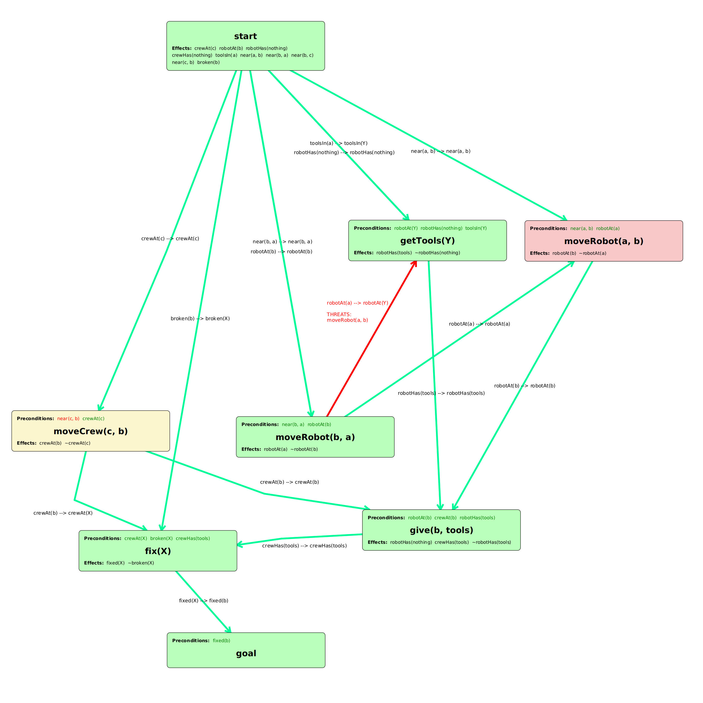
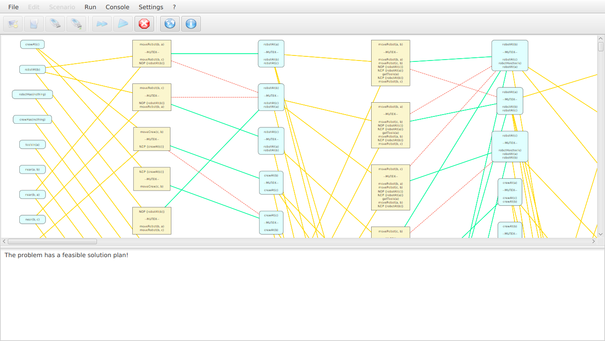
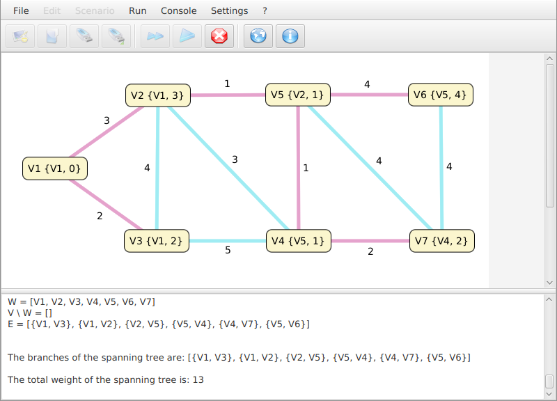

# GraphsJ - Scenarios

*GraphsJ - Example scenarios*

## Introduction

**GraphsJ - Scenarios** provides ready-made scenarios to solve problems in the domains of *Operations Research* and *Artificial Intelligence*.

Apart from their didactic value, these examples can show you how to easily create custom scenarios using the [GraphsJ Scenario Development Kit](https://github.com/giancosta86/GraphsJ-sdk) and its dependencies - especially  [LambdaPrism](https://github.com/giancosta86/LambdaPrism) for Artificial Intelligence and [EighthBridge](https://github.com/giancosta86/EighthBridge) for graph modeling and rendering.

## Installation

The recommended way to install this project is:

0. Run GraphsJ

0. Choose *Settings -> Install predefined scenarios*

## Screenshots

### PlanBricks - Partial Order Planning (POP)

### Add/Delete GraphPlan

### Prim's Shortest Spanning Tree (SST)

## Further references

* [GraphsJ - Scenario Development Kit](https://github.com/giancosta86/GraphsJ-sdk)

* [GraphsJ](https://github.com/giancosta86/GraphsJ)

* [LambdaPrism](https://github.com/giancosta86/LambdaPrism)

* [EighthBridge](https://github.com/giancosta86/EighthBridge)
