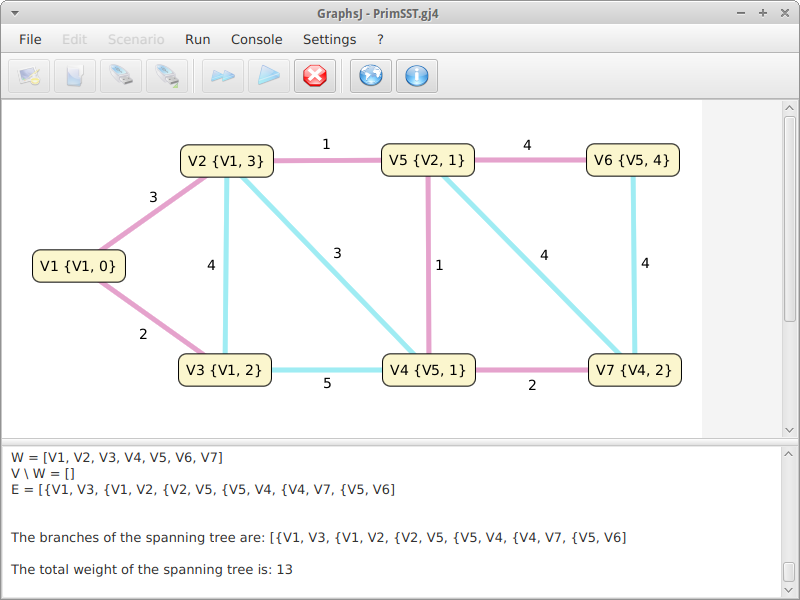

# GraphsJ - Scenarios

*GraphsJ - Example scenarios*

## Introduction

This project provides an example scenario - *Prim's Shortest Spanning Tree* - showing how to easily implement custom scenarios using the latest version of the [GraphsJ Scenario Development Kit](https://github.com/giancosta86/GraphsJ-sdk) and the [EighthBridge](https://github.com/giancosta86/EighthBridge) toolkit.

## Installation

Download the binary JAR file from the [release](https://github.com/giancosta86/GraphsJ-scenarios/releases/latest) section, then copy it to [GraphsJ](https://github.com/giancosta86/GraphsJ)'s scenarios directory to automatically make it available within the program - with no restart required.

## Screenshots

## Example

A problem featuring SST is available as an [example document](examples/BasicPrimSST.gj4) that can be opened in GraphsJ after installing the scenario JAR as described above.

## Further references

* [GraphsJ - Scenario Development Kit](https://github.com/giancosta86/GraphsJ-sdk)

* [GraphsJ](https://github.com/giancosta86/GraphsJ)

* [EighthBridge](https://github.com/giancosta86/EighthBridge)
